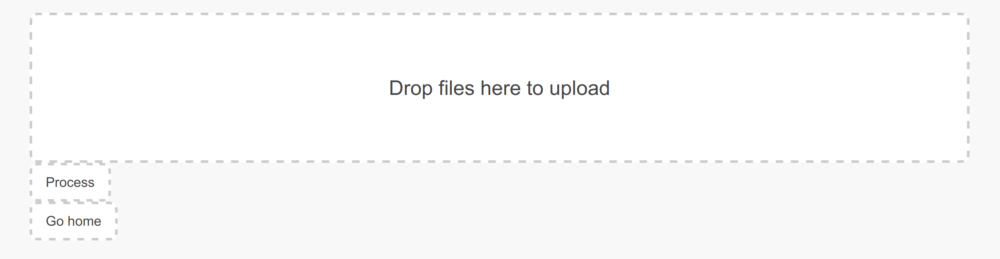
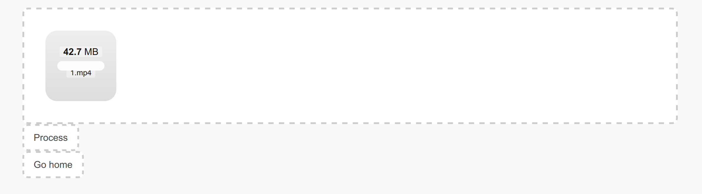
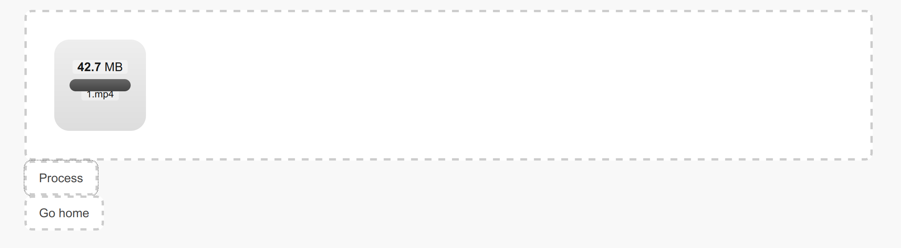
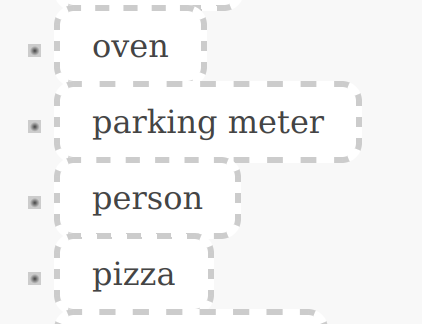
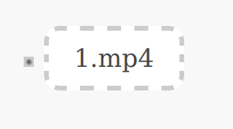
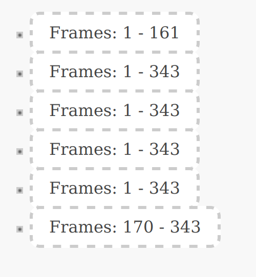

# Thematic indexer
Web-приложение реализующее тематическую индексацию видеофайлов по найденным в них объектам.

## Начало работы
Для начала работы с данным приложением необходимо установить зависимости:

```
pip install -r requirements.txt
```

Для работы данного приложения требуется СУБД Posgres. Для настройки СУБД выполните в консоли следующие команды:

```
sudo -su postgres
psql
```

Далее создаем БД:

```
\i /file_path/create.sql
```

Выходим из консоли Posgres: дважды нажимаем `ctrl+D`.
Настраиваем приложение (предварительно переходим в директорию с файлом `manage.py`):

```
cd web_app
python manage.py makemigrations
python manage.py migrate
```
## Запуск и работа приложения
Настройка приложения закончена. Теперь можно запускать сервер:

```
python manage.py runserver
```

После запуска сервера переходим в браузер на IP-адрес указанный в выводе предыдущей команды (обычно `http://127.0.0.1:8000/`). Будут видны две кнопки:


Для обработки видеофайлов нажимаем на `Process a new video`. Появляется drop-область:



Переносим в данную область необходимый видеофайл:



Нажимаем на кнопку `Process`:



На этом этапе запущен процесс обработки. Не дожидаясь конца обработки, можно посмотреть результат. Для этого возвращаемся на стартовую страницу и нажимаем на кнопку `Show results`:


Появится список классов:



Вибираем необходимый, нажимаем на название. Появляется список файлов, в которых были обнаружены объекты выбранного класса:



Вибираем необходимый, нажимаем на название. Появляется список фрагментов:



Вибираем необходимый, нажимаем на название. Появляется видеопрогрыватель с выбранным видео, первый кадр которого содержит ограничивающий прямоугольник, указывающий на найденный объект:


## Удаление БД и сохранённых файлов
Для удаления БД выполняем следующие команды:

```
sudo -su postgres
psql
\i /file_path/drop.sql
```

Для удаления сохранённых видеофайлов и постеров, на которых изображены ограничивающие прямоугольники, выполняем следующие команды:

```
rm ./web_app/detector/static/detector/videos/*
rm ./web_app/detector/static/detector/posters/*
```
